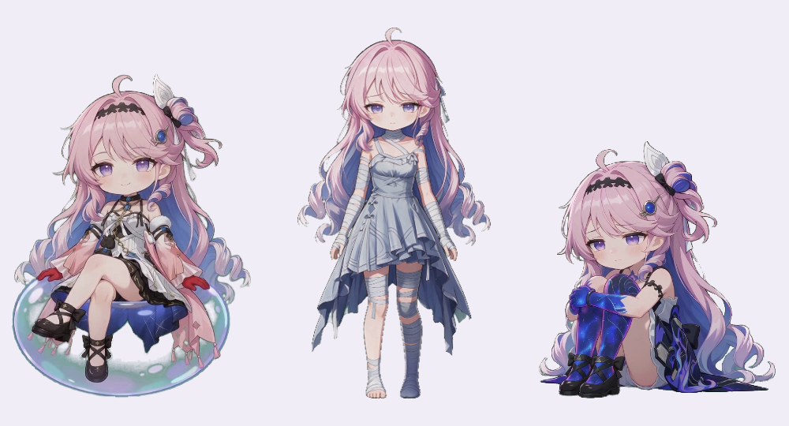

# 达妮娅桌宠 🐾 · Danya Pet

<p align="center">
  
  
  
  
  
</p>

> A transparent desktop companion built on **dsh-pet 0.3.0**. Switch between three Danya outfits, each with its own animation pool. Keep her quietly idle, click for a random response, or enable continuous random actions. Use the Windows installer without an AI client, or connect through the bundled MCP bridge. [English documentation](README.en.md)
>
> 基于 **dsh-pet 0.3.0** 的透明达妮娅桌宠：原服装、缠布条、星空三种形态，各用独立动作池。安静待机、点击随机回应、关闭安静模式后连续随机动作；Windows 安装后直接用，也可通过 MCP 与支持该协议的 AI 工具联动。

**项目源码与 Windows 下载：[GitHub](https://github.com/xunguangzlj-cloud/danya-pet) · [安装包](https://github.com/xunguangzlj-cloud/danya-pet/releases/latest)。** 本项目是基于 dsh-pet 0.3.0 的定制同人桌宠。

---

## 🚀 快速开始（桌面安装）

1. 在 [Release](https://github.com/xunguangzlj-cloud/danya-pet/releases/latest) 下载 `DanyaPet-Setup.exe`、`MergeAssets.exe` 和三个 `danya-assets.dat.00*` 分卷，放到同一个文件夹。
2. 双击 `MergeAssets.exe`，点击“合并素材”，完成后点击“启动安装”。若你拿到的是完整本地安装包，直接将安装程序与 `角色素材.dat` 放在一起启动安装。默认安装到当前用户的 `AppData\Local\Programs\DanyaPet`，无需管理员权限。
3. 完成页可直接启动；之后双击桌面上的「达妮娅桌宠」。

桌面版自带运行环境，无需安装 Node、Python、DSH；离线可播放全部本地视频，不需要 AI 账号、API 密钥或订阅。保持安装程序与素材文件完整，安装完成后可删除安装包。

当前已通过素材解包校验和隔离目录启动验证；安装/卸载向导执行被自动审批拦截，尚未完成向导实机验收，详见交付验证记录。

> 💡 角色视频采用 VP9 Alpha `.webm`。安装版使用 Electron/Chromium 播放透明画面。当前交付为 Windows x64；未提供 macOS、手机、Linux 安装包。
>
> 💡 高清视频占用较多空间。安装包包含独立素材文件，是为了保留原尺寸、帧率与透明编码；不要仅发送安装程序。

## ✨ 功能特性



- **三种形态**：右键点击「切换形态」，依次轮换，无需再选择。切换后保存，下次启动仍使用该形态。
- **动作池独立**：原服装 71 条、缠布条 6 条、星空 6 条。切换时待机、点击、随机及工作状态动作一起更换，互不混播。
- **安静模式**：默认开启待机动作；点击随机播放本形态其他动作，播完回到待机。
- **随机动作模式**：右键关闭安静模式，每段播完按权重选择下一段。新形态没有移动原片，因此随机动作不增加原素材没有的行走动作。
- **画质保留**：新素材为 834×1112 或 1280×720、60 fps，转码不降尺寸与帧率；透明清理后使用无损 VP9 模式。抠像和接缝融合会改变相应像素，放大不会增加原片细节。
- **右键调整大小**：打开独立滑杆，160–1280 px 等比调整、实时保存；数值指画布宽度。
- **动作分类**：待机、表情与互动、日常动作、道具互动、庆祝与特别动作、移动；仅原服装显示工作状态分类，同一普通动作只列一次。
- **桌面互动**：拖拽、甩抛反弹、空白区域点击穿透、动作分类点播及回到初始位置。
- **可选 AI 联动**：MCP 提供状态、动作、信息三个工具；接入后右键可打开已配置的网站。桌宠本身不调用模型。

## 🖱️ 操作一览

| 操作 | 结果 |
|---|---|
| 点击角色 | 随机播放当前形态的点击动作 |
| 右键 → 切换形态 | 直接轮换下一形态及整套动作 |
| 右键 → 安静模式 | 切换安静待机 / 连续随机动作 |
| 右键 → 调整大小 | 打开实时滑杆 |
| 右键 → 动作 | 按分类点播视频 |
| 拖拽角色 | 移动；快速甩出时反弹 |
| 右键 → 回到初始位置 | 回到配置角落 |
| AI 已接入时 → 打开网站 | 用默认浏览器打开配置地址 |
| 右键 → 退出桌宠 | 退出独立桌面程序 |

## 🔌 AI 工具配置（可选）

详见 [AI 接入说明](docs/AI-INTEGRATION.md)。安装后把实际安装路径代入：

```json
{
  "mcpServers": {
    "danya-pet": {
      "command": "C:\\Users\\你的用户名\\AppData\\Local\\Programs\\DanyaPet\\运行时\\达妮娅桌宠.exe",
      "args": ["C:\\Users\\你的用户名\\AppData\\Local\\Programs\\DanyaPet\\源码\\dsh-pet\\standalone\\mcp.mjs"],
      "env": {
        "ELECTRON_RUN_AS_NODE": "1",
        "DANYA_AI_NAME": "你的AI工具",
        "DANYA_SITE_URL": "https://example.com"
      }
    }
  }
}
```

这是通用 **stdio MCP** 配置示例。客户端应支持本地 MCP 进程；其配置文件格式可能不同。桌宠不会自动读取聊天、账户、余额或网页。AI 需要调用工具才会产生状态联动，调用频率由客户端与指令决定。

### DSH 插件模式

本地源码保留 dsh-pet 的 Cordis 插件入口、浏览器入口和 patch。**不要运行 `dsh plugin --profile web add dsh-pet` 期待安装此定制版**，该命令指向上游 npm 包。本定制版已发布到 GitHub，未发布 npm；本地插件加载方式需按使用中的 DSH 版本配置，当前未完成 DSH 客户端实机安装验收。使用 MCP 桥接或独立桌面版可先体验已验证功能。

## ⚙️ 配置与目录

| 路径 | 内容 |
|---|---|
| `启动达妮娅桌宠.exe` | 隐藏启动器 |
| `运行时/` | 自带 Electron 运行环境及第三方许可 |
| `源码/dsh-pet/assets/config.jsonc` | 内置形态、动作池、权重、画面定位 |
| `源码/dsh-pet/assets/webm/` | 83 条透明角色视频 |
| `源码/dsh-pet/standalone/` | 本地服务、MCP 桥、普通设置页 |
| `数据/设置.json` | 大小、安静模式、当前形态 |
| `数据/连接.json` | 本地服务地址；不是账户凭据 |
| `数据/运行日志.txt` | 排查启动或素材问题 |

```json
{
  "size": 640,
  "quietMode": true,
  "formId": "original"
}
```

`formId` 可取 `original`、`bandage`、`star`。各形态在 `forms` 下分别声明 `animations`、`animationWeights`、`animationGeometry`。退出程序后编辑设置文件再启动。用户数据保存在安装目录 `数据/`，卸载保留该目录。

## 🛠️ 开发与验证

源码仓库不包含大体积视频与 Electron 运行环境，完整桌面用户请使用 Release 安装包。开发时先 `npm install --ignore-scripts`，从安装目录复制 `源码/dsh-pet/assets/webm/` 到源码的 `assets/webm/` 后，再运行：

```sh
npm run typecheck
npm test
npm run build:desktop-core
npm run bundle
npm run types
```

共享逻辑在 `src/shared/`，浏览器与 Electron 共用形态选择和菜单组件。本地服务仅绑定 `127.0.0.1`，默认端口 18430；端口占用时寻找可用端口。数据目录的连接文件记录实际地址。

## ❓ FAQ

**不装 AI 可以用吗？** 可以，桌面安装版完全独立。

**卸载怎么办？** 先右键退出桌宠，再用开始菜单或 Windows 的已安装应用卸载。需要清除设置时，另行删除卸载后留下的 `数据/`。

## ©️ 版权所有人

| 版权所有人 | 版权所有内容 |
|---|---|
| Kuro Games（库洛游戏） | 「鸣潮」游戏作品及达妮娅（Denia）角色形象原作 |

*背景、角色视频及预览截图来自用户本地素材库；预览图由本项目运行画面制作。本桌宠为同人创作，与 Kuro Games 无关联。代码许可不包含角色、视频及第三方素材的权利；本项目不主张拥有原作角色版权或官方授权。*

## 🤝 致谢

感谢 [PC2005-cloud/dsh-pet](https://github.com/PC2005-cloud/dsh-pet) 提供桌宠基础实现。本项目基于 **v0.3.0**，基准 commit `972f1cb9437dc256bdcb0707f7a6812069dd93db`；保留原作者 MIT 许可与版权声明。感谢 Kuro Games 的「鸣潮」原作，以及提供角色视频素材的用户。

制作不易，请友友们给个star或到淘宝/咸鱼搜达妮娅windows桌宠支持一下~
不定时更新，欢迎提意见~

代码许可与第三方声明见 [LICENSE](LICENSE)、[NOTICE](NOTICE.md)。角色视频的公开再分发及商业授权范围尚未核实，不以 MIT 代码许可替代素材授权。

[更新记录](CHANGELOG.md) · [英文说明](README.en.md) · [问题反馈](https://github.com/xunguangzlj-cloud/danya-pet/issues)
